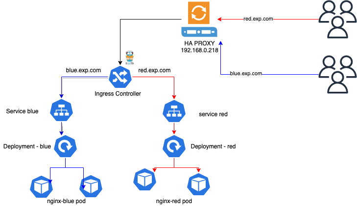
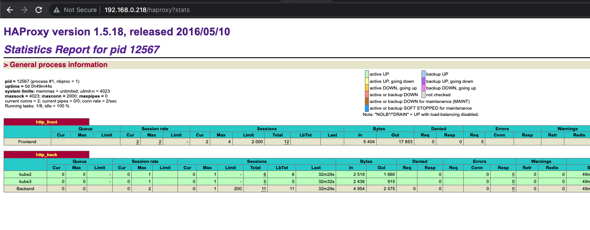
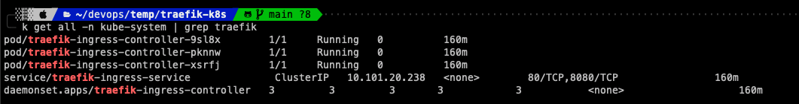

<p align="center">

</p>

[](https://semaphoreci.com/containous/traefik)
[](https://doc.traefik.io/traefik/v1.7)
[](http://goreportcard.com/report/traefik/traefik)
[](https://microbadger.com/images/traefik)
[](https://github.com/traefik/traefik/blob/master/LICENSE.md)


---

## Diagram




## Features

- Continuously updates its configuration (No restarts!)
- Supports multiple load balancing algorithms
- Provides HTTPS to your microservices by leveraging [Let's Encrypt](https://letsencrypt.org)  (wildcard certificates support)
- Circuit breakers, retry
- High Availability with cluster mode (beta)
- See the magic through its clean web UI
- Websocket, HTTP/2, GRPC ready
- Provides metrics (Rest, Prometheus, Datadog, Statsd, InfluxDB)
- Keeps access logs (JSON, CLF)
- Fast
- Exposes a Rest API
- Packaged as a single binary file (made with :heart: with go) and available as a [tiny](https://microbadger.com/images/traefik) [official](https://hub.docker.com/r/_/traefik/) docker image


## Install HAPROXY
- Updating System Packages on CentOS & Install Haproxy


```shell
sudo yum update
sudo yum install haproxy
```
- We are going to create a configuration file /etc/haproxy/haproxy.cfg containing the necessary settings and configurations.
```shell
sudo vi /etc/haproxy/haproxy.cfg
```

```shell
global
   log /dev/log local0
   log /dev/log local1 notice
   chroot /var/lib/haproxy
   stats socket /run/haproxy/admin.sock mode 660 level admin
    stats timeout 30s
    user haproxy
    group haproxy
    daemon

defaults
     log global
     mode http
     option httplog
     option dontlognull
     timeout connect 5000
     timeout client 50000
     timeout server 50000

frontend http_front
     bind *:80
     stats uri /haproxy?stats
     default_backend http_back

backend http_back
     balance roundrobin
     server my_server private_IP:80 check
     server my_server private_IP:80 check
```
- Next: restart HAProxy
```
sudo systemctl restart haproxy
sudo systemctl enable haproxy
```
- Check the haproxy status by the link
  - http://haproxyip/haproxy?stats




## Working with K8s and Traefik

I assumed that you installed K8s cluster normally on your onpremise system, if not, visit here [Install K8s](https://kubernetes.io/docs/setup/production-environment/tools/kubeadm/install-kubeadm/) in our documentation (you will need Docker and Patient :) ).

* Note: all my command use alias which is k = kubectl 

1. Deploy Traefik to K8s: 
   You can install by many many ways, mine is just for old version and it was what I've learn. 

   - We will have 2 files: [traefik-rbac.yaml](examples/k8s/traefik-rbac.yaml) & [traefik-ds.yaml](examples/k8s/traefik-ds.yaml)
   - Install them by using 
        ```
        k apply -f traefik-rbac.yaml
        k apply -f traefik-ds.yaml
        ```
        ```
        k get all -n kube-system | grep traefik
        ```
    